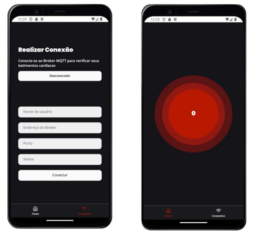

# Welcome to SmartHeart Pulse App 👋


## Platforms
[](https://github.com/expo/expo)
[](https://github.com/expo/expo)
[](https://github.com/expo/expo)

## Features Overview
<ol type="I">
<li> Remote Monitoring: Monitor BPM data remotely in real-time</li>
<li> Real-Time BPM Data Collection</li>
<li> Wi-Fi Data Transmission</li>
<li> Data Sampling Interface</li>
</ol>

## Interface



## Get started

1. Install dependencies:

   ```
   npm install 
3. Start the app:
   
   ```
   npx expo start
5. In the output, you'll find options to open the app in a:

- Development build
- Android emulator
- iOS simulator

⚠️	Expo Go: A limited sandbox for trying out app development with Expo. You can start developing by editing the files inside the app directory. This project uses file-based routing.

## Get a fresh project

When you're ready, run:

    npm run reset-project

This command will move the starter code to the app-example directory and create a blank app directory where you can start developing.
